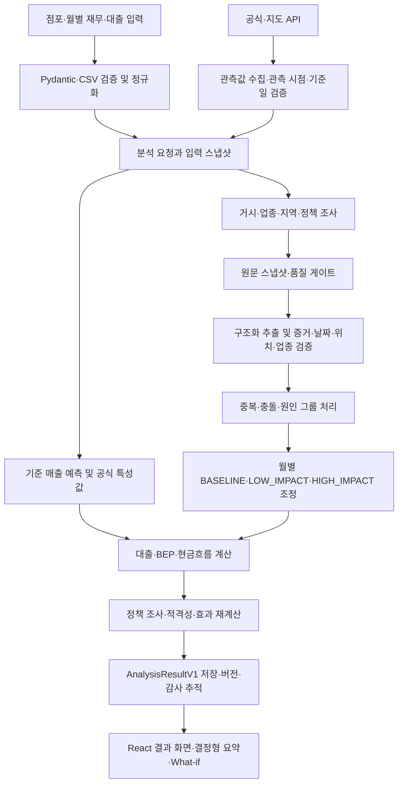

# 시스템 아키텍처

## 목적과 설계 원칙

KB AI 소상공인 현금흐름 분석은 F&B 소상공인의 점포·재무·대출 입력과 공식 경제지표, 검증된 외부 이벤트, 정책 정보를 결합해 월별 현금흐름 시나리오를 만드는 풀스택 MVP입니다. 목표는 단일 숫자를 단정하는 것이 아니라 **기준·저영향·고영향 시나리오, 수치의 근거, 데이터의 한계, 활용 가능한 정책 후보**를 함께 제공하는 것입니다.

이 프로젝트는 AI가 금융 계산을 대신하는 구조가 아닙니다.

- LLM과 검색 제공자는 문서 발견, 제한된 구조화 추출, 분류 보조에만 사용합니다.
- 금액·금리·좌표·정책 적격성·매출 변화율·BEP·현금흐름은 검증된 입력과 버전 관리되는 코드가 계산합니다.
- 근거·날짜·공간·업종·출처 검증에 실패한 이벤트는 수치 계산에 반영하지 않습니다.
- 결측값을 정상값이나 추정값으로 바꾸지 않고 `PARTIAL`, `INSUFFICIENT_DATA`, `NEEDS_INFORMATION`, `REFERENCE_ONLY` 같은 상태로 남깁니다.

## 전체 흐름



`AnalysisOrchestrator`가 위 경로를 하나의 분석 실행으로 연결합니다. 섹션별로 `NOT_STARTED`, `RUNNING`, `COMPLETED`, `PARTIAL`, `FAILED`, `SKIPPED` 상태를 기록하므로 한 제공자나 문서가 실패해도 다른 독립 섹션의 유효 결과는 조회할 수 있습니다.

## 계층과 책임

| 계층 | 주요 경로 | 책임 | 경계 |
| --- | --- | --- | --- |
| HTTP·UI | `backend/src/api`, `frontend` | 비동기 제출·조회, 주소 확인, 한국어 결과 화면 | 브라우저는 계산을 복제하거나 비밀 키를 보유하지 않음 |
| 계약 | `backend/src/contracts`, `backend/schemas` | 버전 있는 입력·결과·근거 데이터 구조 | 계약 밖 필드와 불명확한 상태를 거부 |
| 입력·공식 수집 | `backend/src/ingestion`, `backend/src/normalization` | 사용자 입력, CSV, ECOS·KOSIS·관세청·공공데이터·지도 API | 발표/가용 시점을 모르면 계산 특성값으로 승격하지 않음 |
| 원문 보안 | `backend/src/source_snapshot` | URL 정규화, SSRF 방어, 리디렉션·본문·해시·개정 식별자 기록 | 외부 문서는 명령이 아닌 신뢰할 수 없는 데이터 |
| 조사·추출 | `backend/src/research_agents`, `backend/src/providers` | Gemini 검색, OpenAI 엄격한 스키마 추출, 정책 탐색 | 모델 출력은 후보일 뿐 최종 이벤트가 아님 |
| 검증 | `backend/src/validation`, `backend/src/registries` | 증거, 날짜, 위치, 업종, 중복, 충돌, 규칙 검증 | 검증 실패 후보는 금융 신호가 될 수 없음 |
| 신호·예측 | `backend/src/signals`, `backend/src/forecasting` | 기준 예측, 공식 특성값, 이벤트 점수·월별 조정 | 계수·한계·귀속 정보를 결과에 남김 |
| 금융·정책 | `backend/src/finance`, `backend/src/relief` | 대출 상환, BEP, 현금흐름, 정책 적격성·효과 | 승인·대출 실행·정책 최신성 보장을 하지 않음 |
| 저장·운영 | `backend/src/storage`, `backend/src/orchestration`, `backend/src/operations` | 결과 버전, 작업 상태, 감사 데이터, 프로세스 내부 지표 | 현재는 단일 개발 인스턴스 범위 |

## 주요 데이터 계약

| 계약 | 의미 |
| --- | --- |
| `StoreProfile` | 점포 정보, 월별 매출·비용 이력, 현금, 대출, 비용 노출도 |
| `ResearchRequest` | 분석 기준일, 예측 기간, 지역·업종·반경·조사 범위 |
| `OfficialDataBundle` | 공식 관측값, 출처 시점 정보와 발표·가용 시각, 변환·신선도·오류 |
| `BaselineForecastBundle` | 후보 모델, 백테스트 지표, 월별 예측 하한·중앙·상한 |
| `CanonicalEvent` | 원문 증거와 검증을 통과해 정규화된 이벤트 |
| `ResearchFinding` | 관련성은 있으나 금융 신호 자격이 없는 참고 정보 |
| `ScenarioAdjustmentV2` | 월별 매출·비용·금리 조정과 적용한 신호·이벤트 ID |
| `FinancialScenarioResult` | 월별 현금흐름, 3종 BEP, 유동성 위험과 현금 고갈 |
| `PolicyResultBundle` | 정책 후보, 출처 검증, 적격성, 효과 시뮬레이션, 정렬 |
| `AnalysisResultV1` | 입력·결과·근거·상태·버전을 포함하는 표준 API 응답 |

정확한 필드·열거형·필수 조건은 생성 산출물인 `backend/schemas/*.json` 및 [openapi.json](openapi.json)을 최종 기준으로 합니다.

## 예측 계층과 수치 귀속

결과는 서로 다른 세 개의 예측 계층을 구분합니다.

1. `trend_scenario`: 점포 내부 이력만으로 만든 참조 기준선입니다.
2. `scenarios.BASELINE`: 등록된 공식 데이터 특성값을 기준선에 적용한 시나리오입니다.
3. `scenarios.LOW_IMPACT`, `scenarios.HIGH_IMPACT`: 공식 데이터에 더해 검증·등록 규칙 적격성을 통과한 연구 신호를 적용한 시나리오입니다.

`forecast_layer_comparisons`는 월별 매출, 식재료비, 이자, 순현금흐름, 기말 현금의 계층 간 차이와 특성값 그룹 귀속을 백엔드에서 계산합니다. 프론트엔드는 이를 표현할 뿐 금액을 다시 계산하지 않습니다. 공식 지표는 기간별 변화 상한, 지수 감쇠, 누적 예측 기간 상한을 적용하며 결측 관측치를 임의 보간하지 않습니다.

등록 월간 시계열보다 최신인 공식-주요 이벤트는 일정 조건에서 일시적인 연결 관측으로 사용될 수 있습니다. 이때 값·단위·적용 여부·만료 여부를 `official_features.event_overrides`에 남기며, 등록 시계열이 이벤트 시점에 도달하면 연결 관측은 만료됩니다. 이는 이벤트를 두 번 반영하지 않기 위한 장치입니다.

## 연구 신뢰성 경계

조사는 다음의 분리된 단계로 수행됩니다.

```text
검색 발견 → 최종 URL 해소 → 원문 품질 판정 → 구조화 추출 → 검증 → 신호화 → 금융 적용
```

- 리디렉션 단계마다 공개 HTTP(S) 여부, 사설·링크 로컬 네트워크, 허용 도메인, 크기, 시간, MIME 형식을 검사합니다.
- 탐색용 목록, 빈·짧은 원문, 오래되었거나 무관한 문서, 중복 최종 URL·본문은 명시적인 결과 코드로 남깁니다.
- 모델 입력은 제한된 길이로 자르고 잘림 여부를 기록합니다. 제공자 오류 정보는 위생 처리한 유형·코드·재시도 여부만 보존합니다.
- `CanonicalEvent`와 `StoreSignal`은 엄격한 스키마 및 증거 검증을 통과한 후보만 만들 수 있습니다.
- `ResearchFinding`은 화면 표시용입니다. 계약상 `financial_signal_eligible=true`가 될 수 없으므로 참고 정보가 조용히 금융 수치를 바꾸지 않습니다.
- 정책 추출은 위험 이벤트 파이프라인과 독립적입니다. 한 문서의 실패가 다른 문서에서 검증된 정책 후보를 버리지 않습니다.

## 실패 폐쇄와 부분 결과

| 상황 | 동작 |
| --- | --- |
| 공식 관측값에 발표·가용 시점이 없음 | 관측 시점 기록에는 남길 수 있으나 계산 특성값에서 제외 |
| 지오코딩 실패·모호한 위치 | 임의 좌표를 만들지 않고 `NOT_FOUND`/오류 상태 유지 |
| 인용문·위치 불일치 | 이벤트 후보를 거절하고 신호 생성 차단 |
| 이벤트가 예측 기간·반경·업종 밖 | 적용하지 않으며 원인을 결과에 보존 |
| 매출·비용 이력이 부족함 | 예측 또는 금융 섹션을 `INSUFFICIENT_DATA`/`PARTIAL`로 처리 |
| 공헌이익률이 0 이하 | BEP를 `UNATTAINABLE`로 반환 |
| 정책 필수 조건 누락 | 승인 가능으로 추정하지 않고 `NEEDS_INFORMATION`으로 표시 |
| 제공자·문서 한 건 실패 | 독립 섹션의 유효 결과는 유지하고 실패를 상태·근거에 기록 |

## 저장, 재현성, 감사 추적

분석 결과에는 가능한 범위에서 입력 스냅샷, 멱등성 키, 공식 데이터 출처·시점, 예측·모델 실행, 출처 개정 식별자, 이벤트·신호·원인 그룹, 계수·정책 규칙·금융 계산 버전, 시나리오·결과 버전과 결정론적 해시를 기록합니다.

재현 묶음은 `evidence_replay`에 고정 자료 ID, 캡처 출처, 원문 URL, 비라이브 고지를 보존합니다. `RECORDED_CONTRACT_NOT_LIVE`는 추적 가능한 재생 데이터일 뿐 실제 제공자 호출 성공을 뜻하지 않습니다. 현재 Git 커밋은 기록하지만, 미커밋 작업트리 내용까지 식별하지는 않으므로 재현 결과를 배포할 때는 깨끗한 커밋과 생성 스키마를 같이 보존해야 합니다.

## 사용자·AI 연동 경계

외부 AI 클라이언트 또는 UI는 내부 금융식을 다시 구현하지 않고 표준 API를 사용합니다.

- 결과 조회: `GET /v1/analyses/{run_id}/result`
- 파생 시나리오: `POST /v1/analyses/{run_id}/what-if`
- 확정 이벤트 근거: `GET /v1/events/{event_id}/evidence`
- 거절 후보 근거: `GET /v1/event-candidates/{candidate_id}/evidence`
- 정책 근거: `GET /v1/policies/{policy_id}`

`grounded_summary`는 저장된 결과와 추적 ID에 연결된 결정형 요약입니다. 자유형 챗봇, 대출 신청 실행, 정책 승인 자동화는 이 아키텍처의 현재 범위에 포함되지 않습니다.

## 현재 범위 밖

- 운영용 외부 지속성 큐와 실행 중 작업 복구
- 다중 테넌트, SSO, RBAC, 사용자·조직 격리
- PostgreSQL의 성능·장애 복구·백업 운영 검증
- 실제 점포 데이터로 보정한 영향 계수와 확률적 현금 고갈 시뮬레이션
- 정책 예산·신청 가능 여부·최종 승인 자동 판정
- 네이티브 모바일 앱, 운영 호스팅, 자유형 챗봇 UI

운영 한계는 이 문서와 [OPERATIONS.md](OPERATIONS.md), 개발 단계의 정확한 검증 근거는 [TEST_RESULTS.md](TEST_RESULTS.md)를 참고하세요.
